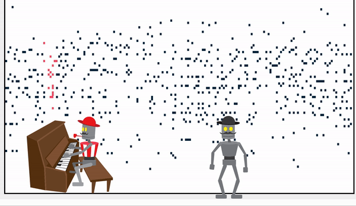

# RAGtime

RNN Audio Generation

### Art-ML-project-3

[link](https://docs.google.com/document/d/10DhPRHXMLF80pXpDS-3YiYcz-0NxnEkoyKhbNUMz-FQ/edit?usp=sharing) to project report

The Result is produced using the [Magenta](https://github.com/tensorflow/magenta) project.

Live playback of midi file with animation [here](https://www.jamesgualtieri.com/Art-ML-project-3/index.html)
